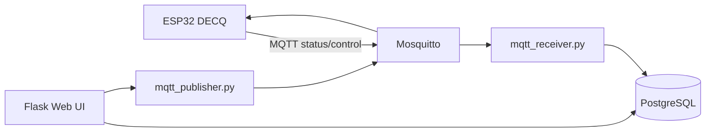

# 服务端说明 / Server (MQTT Web Service)

## 概述

`server/mqtt_web_service/` 是 DECQ 固件的**可选配套后端**：Flask Web UI + MQTT 桥接 + PostgreSQL。

固件在不开启网络模式时可独立运行；开启 MQTT 后需自建 Broker，并可选用本服务做设备管理与远程控制。

## 架构



## 环境要求

| 组件 | 版本建议 |
|------|----------|
| Python | 3.10+ |
| PostgreSQL | 14+ |
| Redis | 6+（Celery 可选） |
| MQTT Broker | Mosquitto 等 |

## 配置

无 `.env` 时自动加载 `.env.example` 占位符。生产部署时创建 `.env` 并填入真实 PostgreSQL / MQTT 凭据即可。

| 变量 | 说明 |
|------|------|
| `SECRET_KEY` | Flask 会话密钥（自行生成） |
| `SQLALCHEMY_DATABASE_URI` | PostgreSQL 连接串 |
| `MQTT_BROKER_URL` / `PORT` | 与固件 `MQTT_SERVER` 一致 |
| `MQTT_USERNAME` / `PASSWORD` | Broker 认证 |
| `ENABLE_MQTT` | `False` 时可仅调试 Web |
| `FREEZE_MODE` | 维护模式：限制注册/绑定 |

**切勿提交 `.env` 到 Git。**

## 初始化数据库

```bash
cd server/mqtt_web_service
export FLASK_APP=run.py
flask db upgrade
```

## 开发运行

```bash
python run.py
# 默认 http://0.0.0.0:8000
```

## MQTT 协议（与服务端实现对齐）

### 设备 → 云（`devices/{device_id}/status`）

| 载荷 | 服务端行为 |
|------|------------|
| `online` | 标记在线，新设备自动建库 |
| `offline` | 离线 |
| `paused` / `running` | 运行状态 |
| `mode/xxx` | 更新模式字符串 |
| JSON 含 `"return": N` | 更新倒计时秒数 |

### 云 → 设备（`devices/{device_id}/control`）

| 格式 | 示例 |
|------|------|
| 简单命令 | `pause`、`resume`、`upgrade` |
| action/value | `dd_all_keys_press_time/100` |
| JSON | `{"enabled": true, "dd_bait_key": 33}` |

> 注意：部分历史代码用 Python `str(dict)` 下发，固件 `wifi_mqtt.cpp` 已兼容 JSON 与 `action/value` 两种形式。

## 机型路由（Web）

| URL 前缀 | Handler | 说明 |
|----------|---------|------|
| `/cq` | cq_handler | DECQ 系列 |
| `/dd` | dd_handler | DD 系模板 |
| `/dy` | dy_handler | DY 系 |
| … | … | 见 `app/__init__.py` 蓝图注册 |

## 生产部署要点

1. Gunicorn + Nginx（参考 `start_project.sh`）
2. MQTT 与 Postgres 同机或内网，勿暴露弱密码到公网
3. 替换模板中的示例销售文案
4. 定期备份数据库（**不要**将备份 SQL 提交到公开仓库）

## 安全提示

- 开源版已移除 SQL 备份、真实联系电话与 `.env`
- 激活码/手机号登录逻辑为示例业务，自行评估合规性
- 生产环境请启用 HTTPS、强密码与防火墙

## 相关文档

- [server/README.md](../server/README.md)
- [protocol.md](protocol.md)（固件侧）
- [firmware.md](firmware.md)
