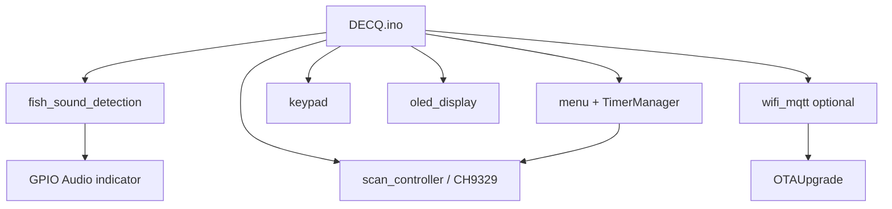

# 系统框图 / Block Diagram

## 数据流

```
┌──────────────┐    I2S 48kHz     ┌──────────────┐
│  PCM1808     │ ───────────────► │    ESP32     │
│  Audio ADC   │                  │  Arduino FW  │
└──────────────┘                  │              │
                                  │  ┌─────────┐ │
┌──────────────┐    UART HID      │  │ FFT     │ │
│   CH9329     │ ◄─────────────── │  │ Energy  │ │
│  USB Bridge  │                  │  │ Detect  │ │
└──────┬───────┘                  │  └─────────┘ │
       │ USB                      │              │
       ▼                          │  ┌─────────┐ │
  ┌─────────┐                     │  │ Menu /  │ │
  │ USB Host│                     │  │ Timer   │ │
  │   PC    │                     │  └─────────┘ │
  └─────────┘                     └──────┬───────┘
                                         │ I2C / GPIO
                    ┌────────────────────┼────────────────────┐
                    ▼                    ▼                    ▼
              ┌──────────┐        ┌──────────┐        ┌──────────┐
              │ SSD1306  │        │ Keypad   │        │ LEDs     │
              │  OLED    │        │  x6      │        │ Status   │
              └──────────┘        └──────────┘        └──────────┘

Optional (network mode):
  ESP32 ── WiFi ── MQTT Broker ── remote control / OTA URL
```

## 软件模块关系



## 文件索引

| 硬件文档 | 内容 |
|----------|------|
| [BOM.md](BOM.md) | 物料清单 |
| [wiring-schematic.md](wiring-schematic.md) | 引脚接线原理图 |
| [README.md](README.md) | 目录说明 |
