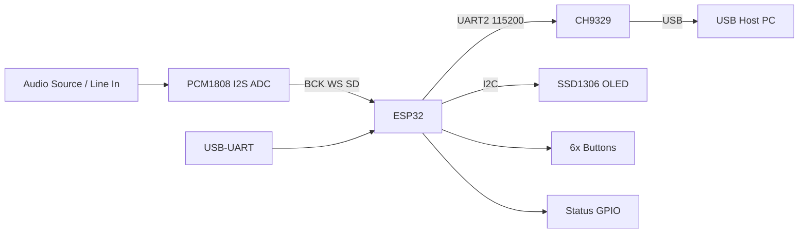

# 接线原理图（文字 + 框图）

> 本文件为**开源参考接线图**，非 KiCad 工程导出。后续可替换为正式 `.pdf` / `.sch` 文件。

## 系统框图



## 电源

```
USB 5V ──► ESP32 DevKit ( onboard 3.3V )
                │
                ├── 3.3V ──► PCM1808, OLED, CH9329 (按模块规格)
                └── GND  ──► 所有模块共地（必须）
```

> CH9329 部分模块为 5V 供电、3.3V TTL，请按模块说明书选择 VCC，**GND 必须与 ESP32 共地**。

## I2S：ESP32 ↔ PCM1808

| ESP32 | 信号 | PCM1808 / 模块丝印 |
|-------|------|---------------------|
| GPIO 26 | BCK / SCK | BCK 或 SCK |
| GPIO 25 | WS / LRCK | WS 或 LRCK |
| GPIO 32 | SD (data in) | DOUT → ESP32 数据输入 |
| 3.3V | — | VCC |
| GND | — | GND |

```
        PCM1808                    ESP32
    ┌─────────────┐            ┌─────────────┐
    │ BCK/SCK     │───────────►│ GPIO 26     │
    │ WS/LRCK     │───────────►│ GPIO 25     │
    │ DOUT        │───────────►│ GPIO 32     │
    │ VCC         │─── 3.3V ───│ 3V3         │
    │ GND         │─── GND ────│ GND         │
    └─────────────┘            └─────────────┘
```

## UART：ESP32 ↔ CH9329

| ESP32 | CH9329 模块 |
|-------|-------------|
| GPIO 16 (RX2) | ← TX |
| GPIO 17 (TX2) | → RX |
| GND | GND |
| 3.3V 或 5V | VCC（看模块） |

```
    ESP32                         CH9329
┌─────────────┐              ┌─────────────┐
│ GPIO17 TX2  │─────────────►│ RX          │
│ GPIO16 RX2  │◄─────────────│ TX          │
│ GND         │──────────────│ GND         │
│ 3V3/5V      │── (optional) │ VCC         │
└─────────────┘              └──────┬──────┘
                                    │ USB
                                    ▼
                                 USB Host
```

## I2C：ESP32 ↔ SSD1306

| ESP32 | OLED |
|-------|------|
| GPIO 21 | SDA |
| GPIO 22 | SCL |
| 3.3V | VCC |
| GND | GND |

I2C 地址：**0x3C**（常见 128×32 模块）

## 按键（上拉输入）

| 按键 | ESP32 GPIO |
|------|------------|
| K1 | 36 |
| K2 | 35 |
| K3 | 23 |
| K4 | 5 |
| K5 | 34 |
| K6 | 39 |

接法：一端接 GPIO，另一端接 GND；固件使用内部/外部上拉，低电平有效。

## 指示 GPIO

| GPIO | 固件宏 | 用途 |
|------|--------|------|
| 4 | Audio | 音频事件指示 |
| 2 | Wifi_AA | WiFi 状态 LED |
| 15 | MUT_OUT | 输出控制 |
| 18 | MUT_DN | — |
| 19 | MUT_UP | — |

## 布线建议

1. I2S 线长 < 10 cm，远离 USB 高频开关噪声
2. UART 与 I2S 避免平行走长线
3. 模拟音频输入远离 ESP32 天线区域
4. 所有模块**单点共地**到 ESP32 GND

## 引脚总览 ASCII

```
                    ┌────────────────── ESP32 ──────────────────┐
   PCM1808 I2S      │ 26=BCK  25=WS  32=SD                       │
   ────────────────►│                                           │
   CH9329 UART      │ 17=TX2  16=RX2                            │
   ◄──────────────►│                                           │
   OLED I2C         │ 21=SDA  22=SCL                            │
   ◄──────────────►│                                           │
   Keys x6          │ 36 35 23 5 34 39                          │
   ────────────────►│                                           │
   Status           │ 4 2 15 18 19                              │
                    └───────────────────────────────────────────┘
```

## 后续计划

- [ ] 上传 KiCad / EasyEDA 原理图 PDF
- [ ] 上传 PCB 布局图
- [ ] 实物搭建照片

欢迎 PR 补充正式原理图文件。
